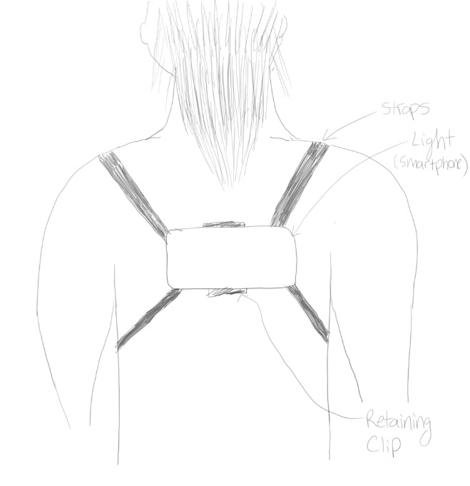
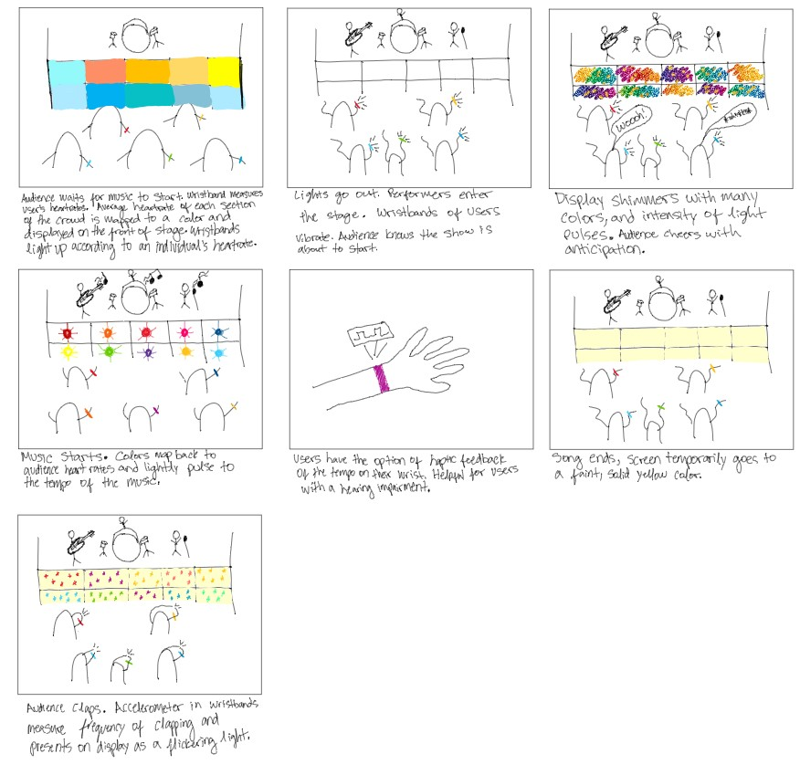

# Staging Interaction

In the original stage production of Peter Pan, Tinker Bell was represented by a darting light created by a small handheld mirror off-stage, reflecting a little circle of light from a powerful lamp. Tinkerbell communicates her presence through this light to the other characters. See more info [here](https://en.wikipedia.org/wiki/Tinker_Bell). 

There is no actor that plays Tinkerbell--her existence in the play comes from the interactions that the other characters have with her.

For lab this week, we draw on this and other inspirations from theatre to stage interactions with a device where the main mode of display/output for the interactive device you are designing is lighting. You will plot the interaction with a storyboard, and use your computer and a smartphone to experiment with what the interactions will look and feel like. 

_Make sure you read all the instructions and understand the whole of the laboratory activity before starting!_

## Prep

### To start the semester, you will need:
1. Read about Git [here](https://git-scm.com/book/en/v2/Getting-Started-What-is-Git%3F).
2. Set up your own Github "Lab Hub" repository to keep all you work in record by [following these instructions](https://github.com/FAR-Lab/Developing-and-Designing-Interactive-Devices/blob/2021Fall/readings/Submitting%20Labs.md).
3. Set up the README.md for your Hub repository (for instance, so that it has your name and points to your own Lab 1) and [learn how to](https://guides.github.com/features/mastering-markdown/) organize and post links to your submissions on your README.md so we can find them easily.

### For this lab, you will need:
1. Paper
2. Markers/ Pens
3. Scissors
4. Smart Phone -- The main required feature is that the phone needs to have a browser and display a webpage.
5. Computer -- We will use your computer to host a webpage which also features controls.
6. Found objects and materials -- You will have to costume your phone so that it looks like some other devices. These materials can include doll clothes, a paper lantern, a bottle, human clothes, a pillow case, etc. Be creative!

### Deliverables for this lab are: 
1. 7 Storyboards
1. 3 Sketches/photos of costumed devices
1. Any reflections you have on the process
1. Video sketch of 3 prototyped interactions
1. Submit the items above in the lab1 folder of your class [Github page], either as links or uploaded files. Each group member should post their own copy of the work to their own Lab Hub, even if some of the work is the same from each person in the group.

### The Report
This README.md page in your own repository should be edited to include the work you have done (the deliverables mentioned above). Following the format below, you can delete everything but the headers and the sections between the **stars**. Write the answers to the questions under the starred sentences. Include any material that explains what you did in this lab hub folder, and link it in your README.md for the lab.

## Lab Overview
For this assignment, you are going to:

A) [Plan](#part-a-plan) 

B) [Act out the interaction](#part-b-act-out-the-interaction) 

C) [Prototype the device](#part-c-prototype-the-device)

D) [Wizard the device](#part-d-wizard-the-device) 

E) [Costume the device](#part-e-costume-the-device)

F) [Record the interaction](#part-f-record)

Labs are due on Mondays. Make sure this page is linked to on your main class hub page.

## Part A. Plan 

**Describe your setting, players, activity and goals here.**

Setting: Outside during a concert.

Players: user, audience, performers, security

Activity: Performers are playing music, audience is listening and reacting to music, user is communicating emotions to other users/audience members and performers.

Goals: 

User - Give realtime feedback of personal experience of performance.

Audience - Enjoy performance and visually see the heartrate responses of users.

Performers - Give audience a good experience.

Security - Keep everyone safe.

**Summarize feedback you got here.**

Originally for my storyboard I did not include fingers on the hands of my users. This made it difficult for my teammates to discern what the third panel of my storyboard was conveying. By adding fingers to my drawing, the context of the drawing became clearer.

## Part B. Act out the Interaction
**Are there things that seemed better on paper than acted out?**
**Are there new ideas that occur to you or your collaborators that come up from the acting?**

On paper my interaction did not originally include any additional sensors. When acting out the interaction, it became clear that I would need some measurement to map the color to. This lead me to the idea of using a person's heartrate to map a color to the device.

## Part C. Prototype the device
**Give us feedback on Tinkerbelle.**

I liked how to the tinkerbelle lab allows for us to focus on the interaction portion of design. By reverting all the backend workings to the computer controlling the light, I did not have to think so much on how I would design additional sensors and actuators. This also prevented me from worrying to much about how I would program the device to complete the interaction.

## Part D. Wizard the device

**Include your first attempts at recording the set-up video here.**

**Show the follow-up work here.**

New Goal is to have the median heartrate response display on the stage of performers:

## Part E. Costume the device
**Include sketches of what your device might look like here.**
**What concerns or opportunitities are influencing the way you've designed the device to look?**

Costume 1

This first design has the user wear the device around their neck. Although this allows for a hands-free experience and allows the user to dance, it is susceptible to overheating.

The second design allows for the user to wear the device on their back. It allows for a hands free experience. It also allows others to view the device colors from the rear. This design is still susceptible to overheating.

In the third design, the device is worn on the head with a lantern shade. This allows for the device to light up the lantern and is more ideal for lowlight settings. The placement on the head makes the light more visible by others the previous two designs, but introduces a risk of the device getting damaged. Additionally the problem of overheating is not as great of an issue, although this aspect can still be improved upon. 

## Part F. Record
**Take a video of your prototyped interaction.**

**Please indicate anyone you collaborated with on this Lab.**

I worked with Sam Willenson to act-out my prototype design and collaborated on how to stage the scene. Mariia Dobko gave me feedback on my storyboard (see storyboard section.)

# Staging Interaction, Part 2 

This describes the second week's work for this lab activity.

## Prep (to be done before Lab on Wednesday)

\*\***Summarize feedback from your partners here.**\*\*

My partner Grace Nho mentioned a product that is similar to my concept. She told me that Kpop fans will carry lightsticks at performances to display their support for a certain group. Each lightstick has color schemes and a design specific to a particular group. Fans will show use their lightsticks throughout all performance. Consequently, people are able to visually see where fans of a particular group are.

Grace's insight gave me the idea to integrate a display in my design that shows the heartrate responses of sections of users, by location in the crowd. This gives a visual map of the "vibes" of the audience, and allows users to move to parts of the crowd that better suit the experience they wish to have.

## Make it your own

\*\***Document everything here. (Particularly, we would like to see the storyboard and video, although photos of the prototype are also great.)**\*\*

I will slightly be altering the goal of my device. For this iteration of my device I integrated a display showing the average heartrate of users by section in the crowd. This is in addition to the wristbands for each user, that show an individual's heartrate through color. The wristband will also have the capability of haptic vibration to signal to the audience when the next performance is about to begin. An optional feature is to also vibrate the wristband, pulsing to the tempo of the music.

Interactions Depicted:
1. Lights on, mapped to audience heartrate. Crowd murmurs in anticipation.
2. Lights go out, wristband vibrates. Audience knows the show is about to start and cheer.
3. Lights flicker as the performers enter the stage.
4. Music begins and lights pulse to the temp of the music.

This prototype video uses LEDs as a stand-in for the display on the stage. An Arduino Uno was used to program the individual LEDs. A DC motor was used to simulate the vibrations of the wristband. The color changes of the wristband are not shown in this prototype video, however, the first prototype video above depicts the same color-changing functionality of the wristband.
